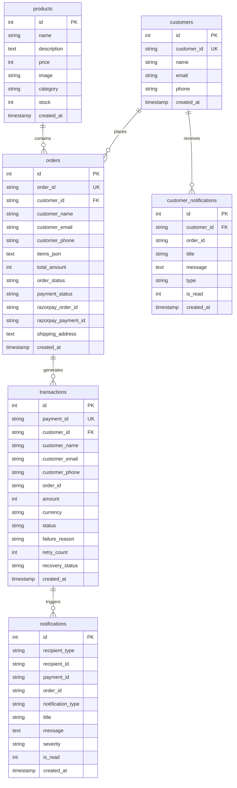

# RecoverAI & Aura Store: Master Technical Specification & Reproduction Blueprint

> **Master Engineering & Architecture Document**  
> This specification documents the entire RecoverAI & Aura Store platform: technologies used, architecture, file-by-file implementations, database schemas, autonomous agent logic, deployment configs, and step-by-step reproduction instructions for any developer or AI coding model.

---

## 1. Executive Summary & Platform Overview

**RecoverAI & Aura Store** is a unified, full-stack, enterprise-grade e-commerce and autonomous payment recovery platform. It consists of two seamlessly integrated systems:

1. **Aura Storefront (Customer-Facing)**:
   - Next-generation consumer electronics and lifestyle e-commerce web application.
   - Interactive 10-item high-resolution product catalog with category filtering (`Audio`, `Wearables`, `Gaming`, `Lifestyle`, `Accessories`, `Power`, `Tech`).
   - Real-time shopping cart with slide-out drawer, live quantity increment/decrement, and instant item removal.
   - Razorpay test checkout integration with automatic order creation, payment signature verification, and live customer order tracking.

2. **RecoverAI Merchant Platform & Autonomous Agent (Merchant-Facing)**:
   - Real-time merchant dashboard tracking payment volume, failed revenue, recovery efficiency rate, pending recovery pipelines, and manual review flags.
   - Real-time transaction management table with live search, status filters, deep customer profile correlation, and database-level transaction deletion.
   - **Autonomous Recovery Agent**: An agentic policy engine with deterministic guardrails and LLM reasoning that intercepts failed Razorpay webhooks, diagnoses root causes (e.g. `BAD_REQUEST_ERROR`, `GATEWAY_ERROR`, `BANK_FAILURE`), selects optimal recovery strategies (e.g. smart payment link dispatch via WhatsApp/SMS, dynamic bank rail switching, autonomous retry scheduling), and logs audit events.

3. **Cloud Database & Unified Serverless Deployment**:
   - Dual-mode database layer: Zero-config SQLite for local/offline testing + Supabase PostgreSQL for cloud production using pure-Python `pg8000` driver.
   - Single unified Vercel Serverless deployment running both FastAPI Python backend and React Vite frontend under one domain.

---

## 2. Technology Stack & Dependencies

### Frontend
- **Framework**: React 18+ with Vite 6
- **Routing & State**: React Context API (`CartContext`), SPA view router (Storefront, Products, Product Detail, Cart, Checkout, Order Tracking, Merchant Console)
- **Styling**: Vanilla CSS with custom glassmorphism design system (`src/index.css`), curated HSL color palette, dark mode aesthetics, and micro-animations
- **Icons**: `lucide-react`
- **Build Tool**: Vite (`npm run build` -> `dist/`)

### Backend
- **Framework**: FastAPI (Python 3.10 - 3.14 compatible) with Uvicorn ASGI server
- **Database & ORM**: SQLAlchemy 2.0+ declarative models
- **Database Drivers**:
  - SQLite (Local development & `/tmp` serverless fallback)
  - PostgreSQL / Supabase (`pg8000` pure-Python driver for serverless environments)
- **Validation**: Pydantic v2 schemas
- **Testing**: Pytest with `httpx` (`81 passing test cases`)

### Cloud & Deployment
- **Hosting**: Vercel Serverless Functions (`api/index.py`) + Static SPA (`dist/`)
- **Payment Gateway**: Razorpay Test Mode (`rzp_test_...`)
- **Database Host**: Supabase PostgreSQL (`postgresql+pg8000://...`)

---

## 3. Repository Directory Structure & File Map

```text
Razorpay/
├── api/
│   ├── index.py                    # Vercel Serverless entrypoint combining FastAPI routers
│   └── requirements.txt            # Python dependencies for Vercel deployment
├── backend/
│   └── app/
│       ├── __init__.py
│       ├── config.py               # Environment configuration (Razorpay keys, DB URLs)
│       ├── database.py             # RecoverAI SQLAlchemy engine with Supabase & SQLite support
│       ├── main.py                 # RecoverAI standalone FastAPI app on port 8000
│       ├── models.py               # SQLAlchemy models (Transaction, Notification)
│       ├── schemas.py              # Pydantic schemas for transactions, alerts, stats
│       ├── routes/
│       │   ├── demo.py             # Demo scenario trigger endpoints (Bank failure, Auth failure)
│       │   ├── notifications.py    # Notification stream and mark-as-read endpoints
│       │   ├── transactions.py     # Transaction CRUD, stats, and DELETE endpoints
│       │   └── webhooks.py         # Razorpay webhook listener and recovery trigger
│       └── services/
│           ├── llm_service.py      # LLM reasoning service with rule-based fallback
│           ├── policy_engine.py    # Deterministic guardrails and recovery decision rules
│           ├── razorpay_service.py # Razorpay API client integration
│           ├── recovery_agent.py   # Autonomous orchestrator executing recovery plans
│           └── recovery_analyzer.py# Failure classification & risk analyzer
├── ecommerce/
│   ├── backend/
│   │   └── app/
│   │       ├── database.py         # Aura Storefront SQLAlchemy engine
│   │       ├── main.py             # E-commerce FastAPI app on port 8001
│   │       ├── models.py           # Product, Customer, Order, CustomerNotification models
│   │       └── routes/
│   │           ├── config.py       # Public Razorpay key ID endpoint
│   │           ├── orders.py       # Order creation, customer order retrieval, order status
│   │           ├── payments.py     # Razorpay order generation & signature verification
│   │           └── products.py     # Product catalog filtering and detail queries
│   └── frontend/                   # Standalone Aura Storefront source mirror
├── frontend/                       # Standalone RecoverAI Dashboard source mirror
├── src/                            # Unified Master Frontend (Vite root)
│   ├── App.jsx                     # Root router, role switcher, and merchant data polling
│   ├── index.css                   # Master glassmorphic CSS design system
│   ├── main.jsx                    # React 18 DOM mount point
│   ├── components/
│   │   ├── CartDrawer.jsx          # Slide-out cart drawer with quantity & delete controls
│   │   ├── CustomerProfileModal.jsx# Customer correlation history and metrics modal
│   │   ├── ErrorBoundary.jsx       # Global React error boundary
│   │   ├── Header.jsx              # Universal responsive navigation bar
│   │   ├── MetricCards.jsx         # Merchant KPI stat cards (Total, Failed, Recovered, Rate)
│   │   ├── Navbar.jsx              # Storefront header with live cart badge
│   │   ├── NotificationDrawer.jsx  # Recovery audit activity stream drawer
│   │   ├── PaymentModal.jsx        # Razorpay checkout modal wrapper
│   │   ├── ProductCard.jsx         # Storefront product card with image and Add to Cart
│   │   ├── RecoveryPipeline.jsx    # Visual pipeline showing in-flight recovery steps
│   │   ├── RoleModal.jsx           # Role selection modal (Customer vs Merchant)
│   │   ├── TransactionDetailDrawer.jsx # Deep transaction audit trail & diagnostic drawer
│   │   └── TransactionTable.jsx    # Merchant transaction list with live search and DELETE
│   ├── context/
│   │   └── CartContext.jsx         # Cart state (items, subtotal, addToCart, updateQuantity, removeFromCart)
│   ├── pages/
│   │   ├── CartPage.jsx            # Dedicated shopping cart page with order summary
│   │   ├── CheckoutPage.jsx        # Customer address form & Razorpay payment launcher
│   │   ├── CustomerOrdersPage.jsx  # Customer order history and live delivery tracking
│   │   ├── CustomerProfilePage.jsx # Customer account info and order stats
│   │   ├── HomePage.jsx            # Landing page with hero banner, badges & featured catalog
│   │   ├── OrderSuccessPage.jsx    # Payment confirmation and receipt page
│   │   ├── ProductDetailPage.jsx   # Full product view with specs and Add to Cart
│   │   └── ProductsPage.jsx        # Full product catalog with live search & category chips
│   └── services/
│       └── api.js                  # Frontend API client with AbortController & fallback catalog
├── scripts/
│   ├── export_all_to_supabase_sql.py # Complete SQLite-to-PostgreSQL SQL dump exporter
│   ├── migrate_to_supabase.py      # 1-command live database migration to Supabase
│   ├── seed_database.py            # Local demo transaction and catalog seeder
│   └── simulate_payment_failure.py # Razorpay webhook simulator for test recovery
├── tests/                          # 81 Pytest test cases covering backend, models, and policies
├── supabase_complete_dump.sql      # Complete Supabase PostgreSQL schema with 1,000+ seed records
├── supabase_schema.sql             # Clean PostgreSQL table definitions and indexes
├── vercel.json                     # Vercel serverless routing rewrites
├── package.json                    # Node dependencies and scripts
└── pytest.ini                      # Pytest configuration
```

---

## 4. Database Schema & Architecture

The database supports both SQLite and PostgreSQL (Supabase/Neon/RDS) through SQLAlchemy ORM.

### Database Tables Specification



### Table Definitions

1. **`products`**:
   - `id` (INTEGER PRIMARY KEY)
   - `name` (VARCHAR): Product name
   - `description` (TEXT): Full item description
   - `price` (INTEGER): Price in paise (e.g., `499900` = ₹4,999.00)
   - `image` (VARCHAR): High-resolution Unsplash image URL
   - `category` (VARCHAR): `Audio`, `Wearables`, `Gaming`, `Lifestyle`, `Accessories`, `Power`, `Tech`
   - `stock` (INTEGER): Available inventory count
   - `created_at` (TIMESTAMP): Creation timestamp

2. **`orders`**:
   - `order_id` (VARCHAR UNIQUE): Unique order ID (e.g. `ord_aura_101`)
   - `customer_id` (VARCHAR): Correlated customer ID
   - `customer_name`, `customer_email`, `customer_phone`: Customer checkout info
   - `items_json` (TEXT/JSONB): Serialized JSON array of ordered items, quantities, and prices
   - `total_amount` (INTEGER): Total order amount in paise
   - `order_status` (VARCHAR): `created`, `processing`, `completed`, `cancelled`
   - `payment_status` (VARCHAR): `pending`, `paid`, `failed`
   - `razorpay_order_id`, `razorpay_payment_id`: Razorpay gateway tracking IDs
   - `shipping_address` (TEXT): Delivery address

3. **`transactions`**:
   - `payment_id` (VARCHAR UNIQUE): Razorpay payment ID (e.g. `pay_mock_123` or `pay_demo_seed_001`)
   - `customer_id`: Correlated customer identifier
   - `amount` (INTEGER): Transaction volume in paise
   - `status` (VARCHAR): `captured`, `failed`, `recovered`
   - `failure_reason` (TEXT): Diagnostic failure message (e.g., Bank gateway timeout)
   - `retry_count` (INTEGER): Number of automated recovery retry attempts
   - `recovery_status` (VARCHAR): `pending`, `in_progress`, `recovered`, `escalated`

4. **`notifications`** & **`customer_notifications`**:
   - Stores automated recovery alerts, customer SMS/WhatsApp messages, and merchant audit events.

---

## 5. RecoverAI Autonomous Agent Architecture

The recovery engine operates as an autonomous agent pipeline triggered upon payment failure events:

```
[Razorpay Webhook / Checkout Failure]
                 │
                 ▼
      [Recovery Analyzer]
   - Classifies error code (BAD_REQUEST, GATEWAY_ERROR, INSUFFICIENT_FUNDS)
   - Evaluates customer risk & lifetime transaction history
                 │
                 ▼
      [Policy Engine (Deterministic Guardrails)]
   - Rule 1: Max 3 automated retries per transaction
   - Rule 2: Exclude hard-declined stolen cards / fraud alerts
   - Rule 3: Enforce min 60s backoff for bank gateway timeouts
                 │
                 ▼
      [LLM Diagnostic & Reasoning Engine]
   - Evaluates optimal customer channel (WhatsApp vs Email vs In-App)
   - Drafts personalized recovery message with 1-click retry payment link
                 │
                 ▼
      [Autonomous Action Execution]
   - Dispatches notification to customer & merchant
   - Schedules background retry / dynamic bank rail switch
   - Updates transaction status in database (failed -> recovered)
```

---

## 6. Frontend Design & Component Blueprint

### Design System Tokens (`src/index.css`)
- **Background**: Deep Navy / Obsidian (`#0b0f19`, `#111827`)
- **Surface Cards**: Glassmorphism with `rgba(255, 255, 255, 0.03)` and `1px solid rgba(255, 255, 255, 0.08)`
- **Accents**: 
  - Primary: `#6366f1` (Indigo Glow)
  - Success: `#10b981` (Emerald)
  - Warning: `#f59e0b` (Amber)
  - Danger: `#ef4444` (Crimson)
- **Typography**: Inter / Outfit modern sans-serif hierarchy with high contrast ratios.

### Key Frontend Components:
1. **`CartDrawer.jsx` / `CartPage.jsx`**:
   - Connected via `useCart()` hook.
   - Increment (`+`), decrement (`-`), and delete item buttons normalize product IDs using `String(item.product_id || item.id)`.
2. **`HomePage.jsx` / `ProductsPage.jsx`**:
   - Initialized with `FALLBACK_PRODUCTS` for **instant zero-lag rendering**.
   - Asynchronously queries `/api/products` with a 2-second `AbortController` timeout to prevent loading lockups.
3. **`TransactionTable.jsx`**:
   - Renders merchant transactions with status pills (`captured` in green, `failed` in red, `recovered` in cyan).
   - Includes real delete button calling `DELETE /transactions/{payment_id}` to permanently remove records from the database.

---

## 7. Unified Vercel Serverless Architecture

In [vercel.json](file:///Users/princesingh/Razorpay%20intership/vercel.json), all frontend routes serve `dist/index.html` while all API calls route to [api/index.py](file:///Users/princesingh/Razorpay%20intership/api/index.py):

```json
{
  "version": 2,
  "buildCommand": "npm run build",
  "outputDirectory": "dist",
  "rewrites": [
    { "source": "/api/:path*", "destination": "/api/index.py" },
    { "source": "/api", "destination": "/api/index.py" },
    { "source": "/products/:path*", "destination": "/api/index.py" },
    { "source": "/products", "destination": "/api/index.py" },
    { "source": "/orders/:path*", "destination": "/api/index.py" },
    { "source": "/orders", "destination": "/api/index.py" },
    { "source": "/transactions/:path*", "destination": "/api/index.py" },
    { "source": "/transactions", "destination": "/api/index.py" },
    { "source": "/webhooks/:path*", "destination": "/api/index.py" },
    { "source": "/webhooks", "destination": "/api/index.py" },
    { "source": "/notifications/:path*", "destination": "/api/index.py" },
    { "source": "/notifications", "destination": "/api/index.py" },
    { "source": "/demo/:path*", "destination": "/api/index.py" },
    { "source": "/demo", "destination": "/api/index.py" },
    { "source": "/health", "destination": "/api/index.py" },
    { "source": "/:path*", "destination": "/index.html" }
  ]
}
```

---

## 8. How to Reproduce & Run This Project From Scratch

### Step 1: Clone the Repository
```bash
git clone https://github.com/unpredictable-prince/Razorpay.git
cd Razorpay
```

### Step 2: Install Dependencies
```bash
# Frontend
npm install

# Backend (Python virtual environment)
python3 -m venv .venv
source .venv/bin/activate
pip install -r requirements.txt
```

### Step 3: Run Tests
```bash
.venv/bin/pytest
# All 81 tests pass
```

### Step 4: Run Locally
```bash
# 1. Start Unified Backend
.venv/bin/python -m uvicorn backend.app.main:app --port 8000 --reload &
.venv/bin/python -m uvicorn ecommerce.backend.app.main:app --port 8001 --reload &

# 2. Start Frontend
npm run dev
```

### Step 5: Setup Supabase Database (Optional for Cloud)
1. Open [Supabase SQL Editor](https://supabase.com/dashboard).
2. Copy and run [supabase_complete_dump.sql](file:///Users/princesingh/Razorpay%20intership/supabase_complete_dump.sql).
3. Set your environment variable:
   ```env
   DATABASE_URL=postgresql://postgres:[PASSWORD]@[HOST]:5432/postgres
   ```

### Step 6: Deploy to Vercel
1. Import repository on [Vercel](https://vercel.com).
2. Framework Preset: **Vite**.
3. Build Command: `npm run build`. Output Directory: `dist`.
4. Deploy!
